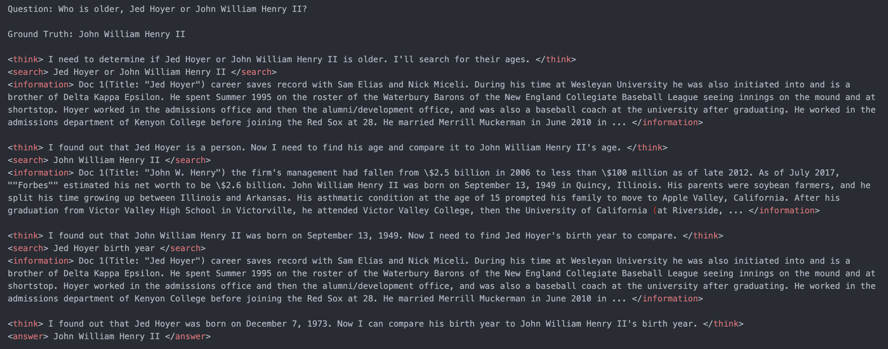

<div align="center">
  

  # Search-R1(二次开发增强版)

  **通过强化学习训练"推理→搜索→回答"的 Agent,基于 [veRL](https://github.com/volcengine/verl) 构建。**

  [](LICENSE)
  [](#安装)
  [](VERL_README.md)
  [](#安装)

  <p align="right"><a href="#english">English</a> | <a href="#中文">中文</a></p>
</div>

---

<a id="english"></a>
## English

---

## Overview

Search-R1 trains an LLM to interleave reasoning and web/wiki search via reinforcement learning (PPO / GRPO). At each turn the model either issues a query (`<search>query</search>`) or commits to an answer (`<answer>...</answer>`); retrieved passages are injected back as `<information>...</information>` and masked out of the training loss (`info_mask`) so the model isn't rewarded or penalized for text it didn't generate.

This repo is a second-development build on top of the open-source [Search-R1](https://github.com/PeterGriffinJin/Search-R1) / [veRL](https://github.com/volcengine/verl) stack. Three areas were extended:

### 1. Hybrid retrieval (BM25 + Dense, RRF fusion)

The original project only supports a single retriever (BM25 *or* Dense), which leaves coverage gaps: keyword-heavy queries hurt Dense, semantic/paraphrased queries hurt BM25. `search_r1/search/hybrid_retrieval.py` (`HybridRetriever`) runs both retrievers in parallel, each returning `topk × 2` candidates, then fuses them with **Reciprocal Rank Fusion**:

```
RRF_score(d) = Σ 1 / (k + rank_i(d))      (k = 60)
```

RRF was chosen over naive score fusion because BM25 and Dense scores live on incomparable scales (BM25 ~10–100, cosine similarity ~0–1) — summing raw scores lets BM25 dominate, and normalize-then-weight fusion needs a tuned weight and is sensitive to outliers. RRF only depends on rank order, so it's robust to that scale mismatch. Two alternative fusion strategies are also implemented for cases where the two retrievers' quality is known to differ (`ScoreWeightedFusion`, min-max normalized) or is comparable (`ConvexCombinationFusion`). The service is a drop-in replacement for the original `retrieval_server.py` — same `POST /retrieve` request/response schema, verified in `scripts/api_compatibility_verifier.py`, so `generation.py` needs no changes.

### 2. Multi-component reward shaping

The original reward is a single Exact-Match score placed on the *last* response token — everything else in the sequence gets zero reward, which starves PPO/GRPO's credit assignment (only ~1% of tokens carry signal). `verl/trainer/main_ppo_format.py::RewardManager` decomposes this into sub-rewards attached at the point in the sequence where the behavior occurs: a **format reward** for well-formed `<search>`/`<answer>` tags, a **retrieval-hit reward** for search calls that actually surface the ground-truth document, and a **search-efficiency reward** that penalizes redundant/unnecessary searches. The auxiliary rewards are capped so their sum stays strictly below the correctness reward, guaranteeing the model can never learn to prefer "helpful-looking but wrong" over "right".

### 3. GRPO advantage estimation enhancement

For a group of `n_agent` rollouts sampled per prompt, trajectories are weighted by outcome (success ×1.5 / failure ×0.6 / partial credit ×1.0) before the standard in-group advantage normalization, with a 5σ clip to exclude outliers. A FIFO replay buffer (capacity 1,000) retains past successful trajectories and mixes ~10% of them into each batch, which counters catastrophic forgetting that on-policy RL is prone to.

### 4. Training data augmentation

`scripts/data_optimization.py` adds an optional pre-processing stage on top of the original data pipeline: query expansion (synonym substitution + rephrasing), difficulty stratification into easy/medium/hard (scored on question length, multi-hop cue words, temporal/negation markers, and named-entity density), 6-category query-intent classification, rule-based quality filtering, and contrastive sample construction (numeric ±1 perturbation + entity substitution to build hard negative/positive pairs). Output stays schema-compatible with the original parquet format, so it's opt-in and doesn't touch the existing data pipeline.

## Architecture



```
Think → <search> query </search> → retrieval service (BM25 / Dense / RRF) → <information> docs </information> → Think → ... → <answer>
```

The RL loop is driven by `RayPPOTrainer` (Ray-orchestrated Actor/Rollout/Ref/Critic on FSDP + vLLM); the multi-turn agent loop (generate → parse `<search>`/`<answer>` → call retriever → append `<information>` → repeat until `<answer>` or `max_turns`) lives in `search_r1/llm_agent/generation.py::LLMGenerationManager.run_llm_loop`; retrieval is served over a FastAPI endpoint (`POST /retrieve`).

## Installation

```bash
# 1. Environment
conda create -n search-r1 python=3.10 -y && conda activate search-r1
pip install torch torchvision torchaudio --index-url https://download.pytorch.org/whl/cu121
pip install -r requirements.txt && pip install -e .
pip install pyserini faiss-gpu fastapi uvicorn sentence-transformers huggingface_hub

# 2. Data (corpus + FAISS index + preprocessed NQ/HotpotQA, ~20GB)
python scripts/download_data.py --save_path ./data
```

Hardware: 8× GPU with ≥24GB VRAM recommended (A100/A800 80GB for the default 3B/7B configs); CUDA 12.1, Python 3.10.

## Usage

**1. Start the retrieval service** (pick one)

```bash
# dense (E5 + FAISS)
python search_r1/search/retrieval_server.py \
    --index_path data/index/e5_Flat.index --corpus_path data/corpus/wiki-18.jsonl \
    --topk 3 --retriever_name e5 --retriever_model intfloat/e5-base-v2 --faiss_gpu

# hybrid (BM25 + Dense, RRF fusion)
python search_r1/search/hybrid_retrieval.py \
    --bm25_index_path data/index/bm25 --dense_index_path data/index/e5_Flat.index \
    --corpus_path data/corpus/wiki-18.jsonl --topk 10 --fusion_method rrf --rrf_k 60.0 --faiss_gpu
```

**2. Train**

```bash
bash train_grpo.sh   # GRPO, no critic
bash train_ppo.sh    # PPO, with critic
```

Key parameters (`train_grpo.sh` / `train_ppo.sh`):

| Parameter | Default | Meaning |
|---|---|---|
| `DATA_DIR` | `data/nq_search` | training data directory |
| `BASE_MODEL` | `Qwen/Qwen2.5-3B` | base model |
| `max_turns` | 2 | max search rounds per rollout |
| `retriever.url` | `http://127.0.0.1:8000/retrieve` | retrieval service address |
| `retriever.topk` | 3 | docs returned per search call |
| `actor_rollout_ref.rollout.n_agent` | 5 (GRPO) / 1 (PPO) | rollouts sampled per prompt |
| `trainer.total_training_steps` | 1005 | total training steps |

**3. Inference** (with the retrieval service from step 1 still running)

```bash
python infer.py   # edit `model_id` to point at your trained checkpoint
```

## Results

Retrieval quality, measured with `scripts/optimization_benchmark.py` (200 queries / 500 docs, `rrf_k=60`):

| Method | Hit@1 | Hit@3 | Hit@5 | Recall@10 | MRR | Latency |
|---|---|---|---|---|---|---|
| BM25 only | 94.0% | 95.0% | 95.5% | 94.75% | 0.9475 | 1.3ms |
| Dense only (E5) | 97.5% | 98.0% | 98.0% | 95.25% | 0.9783 | 1.4ms |
| **Hybrid (RRF)** | 96.0% | 98.0% | 100.0% | **99.75%** | 0.9723 | 2.6ms |

Hybrid retrieval improves Recall@10 by **+5.0pp** over BM25-only and **+4.5pp** over Dense-only, at ~2x the latency of a single retriever (two calls fused). `rrf_k` sensitivity (Recall@10) was also swept:

| `rrf_k` | 10 | 30 | 60 | 100 | 200 |
|---|---|---|---|---|---|
| Recall@10 | 98.79% | 98.20% | 98.42% | 98.04% | 97.66% |

Reproduce with:

```bash
python scripts/optimization_benchmark.py
```

Reward shaping and data augmentation are implemented and unit-verifiable (see `verl/trainer/main_ppo_format.py::RewardManager` and `scripts/data_optimization.py`), but not yet backed by a full RL training run in this repo — no end-to-end training curves are claimed here.

## Project structure

```
search_r1/
├── llm_agent/          # multi-turn Think-Search-Answer loop (generation.py, tensor_helper.py)
└── search/             # retrieval backends: BM25, Dense (FAISS), hybrid RRF fusion, rerank
verl/                   # RL training engine (Ray + FSDP + vLLM), forked from ByteDance's veRL
scripts/                # data download/preprocessing, retrieval benchmarking, data augmentation
train_grpo.sh / train_ppo.sh   # training entry points
```

## Acknowledgement

Built on [veRL](https://github.com/volcengine/verl) ([HybridFlow paper](https://arxiv.org/abs/2409.19256v2)) and [Search-R1](https://github.com/PeterGriffinJin/Search-R1). See [VERL_README.md](VERL_README.md) for the upstream framework's citation and acknowledgements.

## License

[Apache License 2.0](LICENSE)
